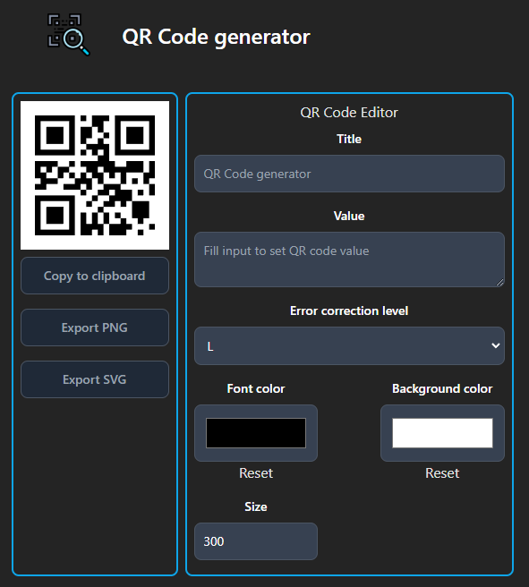

# QR Code generator
Small webapp to generate QR Code

<center>



</center>

## Start from source code
```shell
npm install
npm run dev
```

## Start from container
```shell
docker pull haingue/qr-code-generator:latest
docker run -p 8080:80 haingue/qr-code-generator:latest
```


